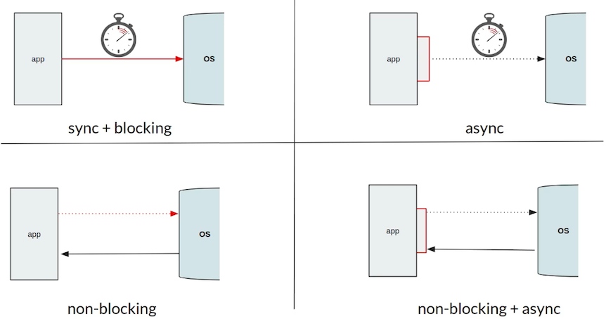

## Java Reactive Programming

#### Limitations of Threads per Request and Need of Reactive Programming

- I/O Tasks - Reading / Writing to File / DB etc. These tasks are time-consuming, and the thread remains blocked till the task is completed.
- Also, each thread needs to be given a stack memory (upto 1MB). So more the threads more the memory consumption.

- In the microservices' era, this comes up with more challenges.
- If Service A calls service B and B does a time intensive task like DB call etc. Then A also will remain in blocked state till the B and DB call is complete.
- The traditional thread per-request model is not scalable. They have limitations of maximum concurrent processes they can process.
- We will end up utilizing a lot of system resources as well.

- Horizontal scaling is just a workaround - it is not efficient utilization of resources.

- Event Driven programming (Callback hell!!)

- Types of IO
    - Synchronous + Bocking
    - Async
    - Non-Blocking
    - Async + Non-Blocking



- Reactive Streams Specification
    - initiative to provide asynchronous stream processing with non-blocking back pressure.

- Observer Pattern (Twitter Analogy)
    - Observe and React
    - Publisher, Subscriber, Subscription.
    - Processor Acts like both a subscriber and a publisher.

```Text
A follows B => B is a subscriber to A.
C, D follow B and not A => B acts like a publisher to his followers C, D.
```

#### Reactive Programming

- Reactive Programming is subset of event-driven asynchronous programming in which we register a set of callbacks or listeners to be executed as and when data goes through the pipeline.
- Declarative Data Flow Programming.

- Reactive Programming - 3 Pillars
    - Asynchronous Data Processing
    - Non-blocking
    - Functional / Declarative Style programming

- Reactive Streams - It is a specification and not implementation.
    - Implementation - Akka Streams | rxJava2 | Reactor

## PUBLISHER / SUBSCRIBER COMMUNICATION

##### Step 1 - Subscriber wants to connect

- Subscriber wants to get updates from the Publisher.
- Using the `subscribe` method of the Publisher interface, we will be passing the Subscriber instance to the Publisher.
```java
public interface Publisher<T> {
	public void subscribe(Subscriber<? super T> s);
}
```

##### Step 2 - Publisher calls onSubscribe

- When the publisher accepts the request of the subscriber, it hands over the subscription object to the Subscriber using the `onSubscribe()` method.
```java
public interface Subscriber<T> {
	public void onSubscribe(Subscription s);
	public void onNext(T t);
	public void onComplete();
	public void onError(Throwable t);
}
```

##### Step 3 - Subscription

- After the relation between Subscriber and Publisher through the Subscription object, the Subscriber can request data from the publisher or cancel the subscription if it doesn't want to receive any updates.
```java
public interface Subscription {
	public void request(long n);
	public void cancel();
}
```

##### Step 4 - Publisher pushes data via onNext()

- When Subscriber is requesting any data from the Publisher via an object of Subscription, Publisher can use the `onNext` method to provide the data. If there are 5 items requested, the `onNext` method is called 5 times.

##### Step 5 - onComplete() & onError()

- When there are no more items left to provide to the Subscriber, then the Publisher can call the `onComplete` method to notify the subscriber that its job is done.
- If the Publisher gets any error while trying to process the requested data, it can pass the error details to the Subscriber using `onError` method.
- Once either `onError` or `onComplete` methods are called, there will not be any further calls to the Subscriber.


- Terminologies -
    - **Publisher** - Source | Observable | Upstream | Producer
    - **Subscriber** - Sink | Observer | Downstream | Consumer

## Project Reactor

- Reactor Publisher has two implementations `Mono<T>` and `Flux<T>`.
- Mono
    - It emits 0 or 1 item, followed by onComplete / onError.
- Flux
    - It emits 0 or N items, followed by onComplete / onError.
    - It can behave as an infinite stream - Fetch Data from a data source like DB and provide it to Subscriber when requested.

### Mono

```groovy
import reactor.core.publisher.Mono

// Demo Publisher Stub
private static Mono<String> getName() {
  System.out.println("Inside getName()");
  return Mono.fromSupplier(() -> {
    System.out.println("Generating Name...");
    sleepSeconds(3);
    return "Aditya Garde";
  }).map(name -> name.toUpperCase());
}
```

|Type |Condition       |What to use    |Links      |
|-----|----------------|---------------|-------------|
|Create Mono|Data Already Present |`Mono.just(data)`|[Example](https://github.com/adityagarde/java-reactive-programming/blob/main/src/main/java/com/github/adityagarde/reactor/sec01/_02MonoJust.java) [Example](https://github.com/adityagarde/java-reactive-programming/blob/main/src/main/java/com/github/adityagarde/reactor/sec01/_03MonoSubscribe.java)|
|Create Mono|Data to be Calculated|`Mono.fromSupplier(() -> getData());` `Mono.fromCallable(() -> getData()`|[Example](https://github.com/adityagarde/java-reactive-programming/blob/main/src/main/java/com/github/adityagarde/reactor/sec01/_05MonoFromSupplier.java)|
|Create Mono|Data is coming from CompletableFuture (Async)|`Mono.fromFuture(future)`|[Example](https://github.com/adityagarde/java-reactive-programming/blob/main/src/main/java/com/github/adityagarde/reactor/sec01/_07MonoFromFuture.java)|
|Create Mono|Emit empty once a given Runnable is complete|`Mono.fromRunnable(runnable)`|[Example](https://github.com/adityagarde/java-reactive-programming/blob/main/src/main/java/com/github/adityagarde/reactor/sec01/_08MonoFromRunnable.java)|
|Pass Mono as an argument|Function accepts a Mono<Addrs>, but it does not have any data.|`Mono.empty()`|[Example](https://github.com/adityagarde/java-reactive-programming/blob/main/src/main/java/com/github/adityagarde/reactor/sec01/_04MonoEmptyOrError.java)|
|Return Mono|Function needs to return a Mono|`Mono.error()` `Mono.empty()` && Mono creation types mentioned above|[Example](https://github.com/adityagarde/java-reactive-programming/blob/main/src/main/java/com/github/adityagarde/reactor/sec01/_04MonoEmptyOrError.java)|

